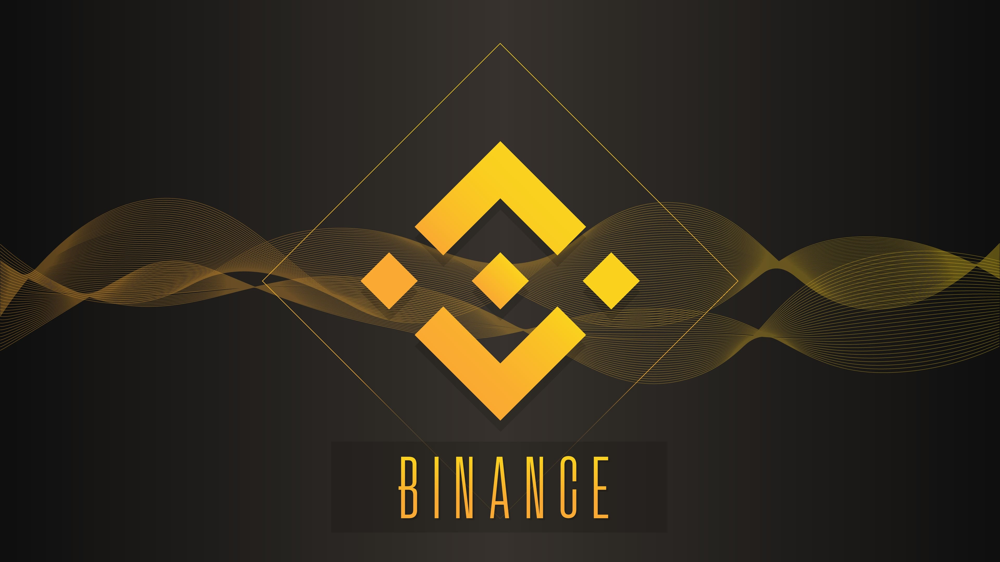

<br/>
<p align="center">
    <a href="https://github.com/TerraMystics"></a>
</p>

<p align="center">
A lightweight library to manage swaps/withdrawals from Fiat to LUNC/LUNA via the Binance Exchange, and makes it very easy for Terra developers to migrate liquidity on-chain.

</p>
<br/>

<p align="center">
  <a href="https://github.com/TerraMystics/Binance.FiatToTerra/blob/main/LICENSE">
  
  </a>
    
  <a href="https://www.nuget.org/packages/Binance.FiatToTerra">
    
  </a>
  
  <a href="https://www.nuget.org/packages/Binance.FiatToTerra">
    
  </a>
</p>

<p align="center">
  <a href="https://docs.terra.money/"><strong>Explore the Docs »</strong></a>
  <br />
  <br/>
  <a href="https://github.com/TerraMystics/Binance.FiatToTerra/tree/main/Binance.FiatToTerra/OnChainPaymentsSimulator">Example App</a>
  ·
  <a href="https://github.com/TerraMystics/Binance.FiatToTerra">API Reference</a>
  ·
  <a href="https://www.nuget.org/packages/Binance.FiatToTerra">NuGet Package</a>
  ·
  <a href="https://github.com/TerraMystics/Binance.FiatToTerra">GitHub</a>
</p>

Helps dApps & developers migrate customer funds from the Binance Exchange to prepare wallets for on-chain transactions & payments.

## Features

- **Written in C#**, with type definitions
- Works with Xamarin, Unity, Asp, and all other frameworks in the .Net Ecosystems
- Makes it easier for dApps to migrate customer funds from a Binance wallet to an OnChain Terra Wallet

## Usage

This package is designed for dApps looking to migrate customer funds from the Binance Exchange to a customer's OnChain Terra Wallet.

## Configure a Binance Api Key

To set a binance Api Key please follow [this](https://binance-docs.github.io/apidocs/spot/en/#introduction)

## Binance Security Restrictions

Due to Binance's security restrictions, customers of your dApps, will be required to configure their Api Keys to enable Withdrawals & Swaps. They will need to pass their Public IP Address.

## Installation & Configuration

Grab the latest version off [NuGet](https://www.nuget.org/packages/Binance.FiatToTerra)

```sh
dotnet add package Binance.FiatToTerra
```

### Manage Swaps & Withdrawals for LUNC

Here we are going to run a Market Price Swap from BUSD to our Terra Coin of choice, then migrate the funds to the customer Terra Wallet.

```cs
// LUNC
void RunSwapForLUNC(){
      var lunc = new FiatToLUNCHelper(
             "customer_api_key",
             "customer_api_secret",
             Binance.FiatToTerra.Models.Enums.StableCoins.BUSD,
             Binance.FiatToTerra.Models.Enums.BinanceEnvironment.Mainnet)
             .ConfigureOnChainTerraWallet("customer_terra_wallet_recovery_words");

      var luncAmount = 200000;

      // Purchase 200,000 LUNC coins & Transfer them to the customer wallet
      var orderId = await lunc.ExecuteSwapForLUNC_WithMarketPrice(luncAmount);
      await lunc.TransferLUNCToTerraStation(luncAmount);
}

// USTC
void RunSwapForUSTC(){
      var ustc = new FiatToUSTCHelper(
             "customer_api_key",
             "customer_api_secret",
             Binance.FiatToTerra.Models.Enums.StableCoins.BUSD,
             Binance.FiatToTerra.Models.Enums.BinanceEnvironment.Mainnet)
             .ConfigureOnChainTerraWallet("customer_terra_wallet_recovery_words");

      var ustcAmount = 200;

      // Purchase 200 USTC coins & Transfer them to the customer wallet
      var orderId = await ustc.ExecuteSwapForUSTC_WithMarketPrice(ustcAmount);
      await ustc.TransferUSTCToTerraStation(ustcAmount);
}

// LUNA
void RunSwapForLUNA(){
      var luna = new FiatToLUNA2Helper(
             "customer_api_key",
             "customer_api_secret",
             Binance.FiatToTerra.Models.Enums.StableCoins.BUSD,
             Binance.FiatToTerra.Models.Enums.BinanceEnvironment.Mainnet)
             .ConfigureOnChainTerraWallet("customer_terra_wallet_recovery_words");

      var lunaAmount = 200;

      // Purchase 200 LUNA coins & Transfer them to the customer wallet
      var orderId = await luna.ExecuteSwapForLUNA_WithMarketPrice(lunaAmount);
      await luna.TransferLUNAToTerraStation(lunaAmount);
}
```

## Binance.FiatToTerra For Unity Developers

If you are using Binance.FiatToTerra for Unity, please make sure to install the [following asset](https://github.com/TerraMystics/NuGetForUnity) in your project, and follow the installation instructions above

## License

This software is licensed under the MIT license. See [LICENSE](./LICENSE) for full disclosure.

© 2022 TerraMystics.
